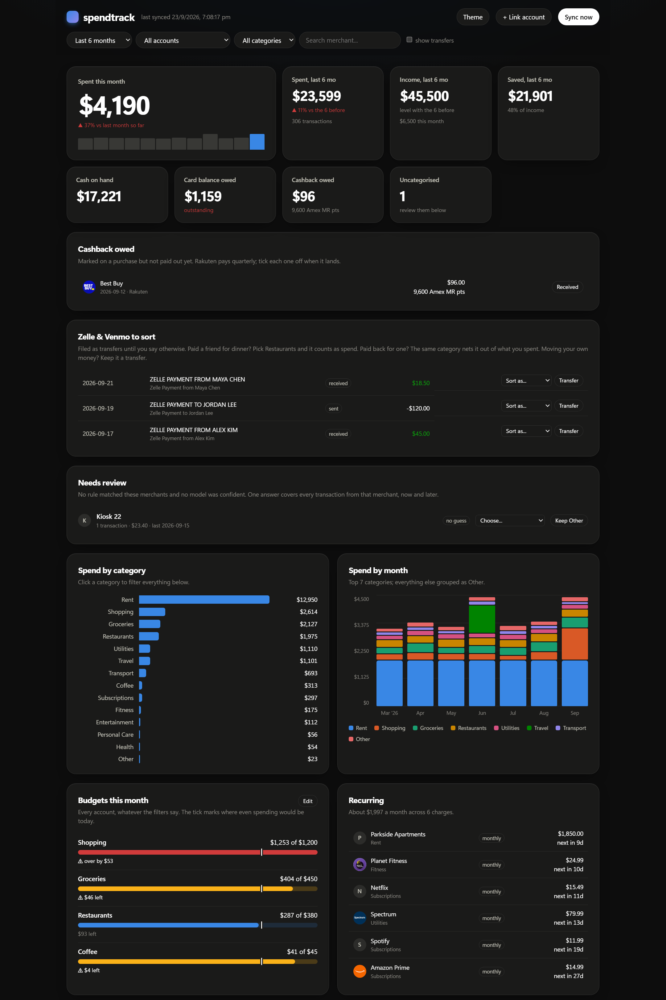
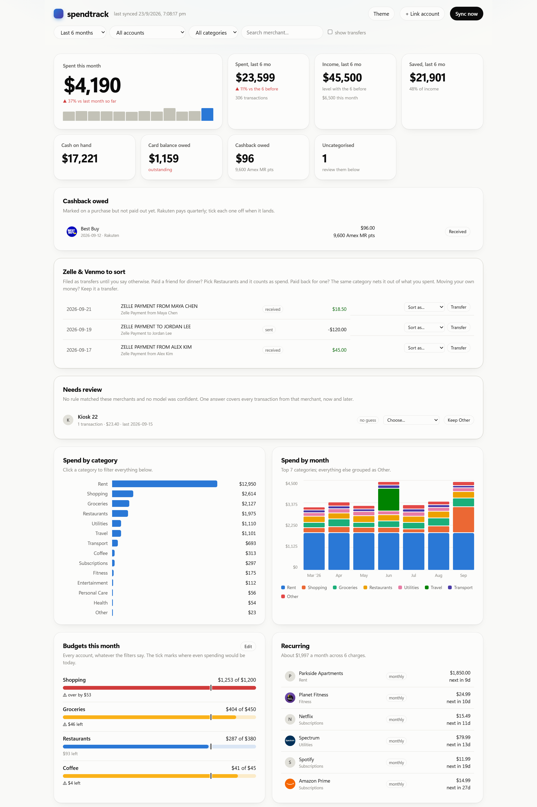
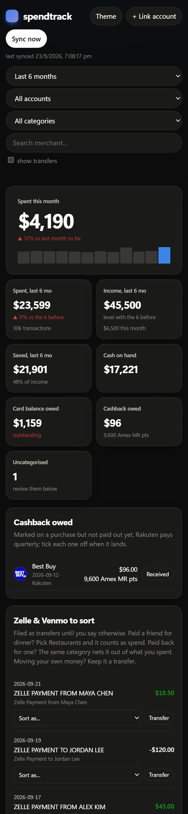

# spendtrack

A local-first tracker for bank and credit card spend. It pulls transactions from
your accounts through [Plaid](https://plaid.com), categorises them, and serves a
dashboard you can open on your laptop or install on your phone. Everything is
stored in one SQLite file on your machine; nothing is sent anywhere except Plaid
and, if you choose, a model server you run yourself.



<p align="center">
  
  &nbsp;
  
</p>

<sub>Screenshots use generated demo data.</sub>

## What it does

- **Syncs every linked account** — cards, checking, savings — through Plaid's
  cursor-based `/transactions/sync`, so each run fetches only what changed.
  Balances, statement dates, due dates and APRs come along for credit cards.
- **Categorises each merchant once.** Your own corrections win, then
  [`rules.toml`](spendtrack/rules.toml), then a cached answer from an optional
  local model, then Plaid's category. A merchant is looked up at most once in the
  life of the database.
- **Counts spend honestly.** Card payments and moves between your own accounts
  are transfers, not spend. Refunds and statement credits net against the
  purchase they reverse.
- **Handles the messy parts of real money:**
  - *Cashback* — mark a purchase as, say, 100% back from Rakuten, paid as
    PayPal cash, Amex Membership Rewards or Bilt points. Totals use what the
    purchase really cost; a tile tracks what you are still owed.
  - *Zelle / Venmo / Cash App* — filed as transfers until you sort them. Paid a
    friend for dinner? Restaurants. Paid back for one? The same category nets
    it out.
  - *One-off categories* — change a single transaction without touching the
    rest of that merchant's history.
- **Dashboard** — spend this month and over any period or custom date range,
  income and savings rate, spend by category and by month, monthly budgets with
  pace markers, recurring charges, a review queue for anything uncategorised,
  and every transaction, searchable and sortable. Installable on a phone as a
  web app that shows your last figures, clearly marked, when the laptop serving
  it is asleep. Light and dark mode.

## Requirements

- Python 3.11+
- A Plaid account. The free **Trial** plan covers personal use; its
  **sandbox** environment is unlimited and uses fake banks.
- Optional: a model server for categorising merchants no rule matches — any
  OpenAI-compatible endpoint such as [Ollama](https://ollama.com) or
  llama.cpp's `llama-server`.

## Setup

```bash
git clone https://github.com/skandansn/spendtrack.git
cd spendtrack
python -m venv .venv
.venv/bin/pip install -e .          # Windows: .venv\Scripts\pip install -e .
cp .env.example .env
```

Fill in `.env` from the Plaid dashboard (Developers → Keys):

| Variable | Purpose |
|---|---|
| `PLAID_CLIENT_ID` | Shared across environments |
| `PLAID_SECRET_SANDBOX` / `PLAID_SECRET_PRODUCTION` | One secret per environment |
| `PLAID_ENV` | `sandbox` or `production` — switch environments by editing this alone |
| `CATEGORIZER` | `llm`, `laya` or `none` — what categorises merchants no rule matches |
| `LLM_BASE_URL`, `LLM_MODEL` | The OpenAI-compatible endpoint and model, when `CATEGORIZER=llm` |
| `LAYA_BASE_URL`, `LAYA_MIN_CONFIDENCE` | A self-hosted [Laya](https://github.com/NandhaKishorM/laya) server, when `CATEGORIZER=laya` |
| `SPENDTRACK_DB` | Database path; defaults to `~/.spendtrack/spendtrack.db` |

## Usage

```bash
spendtrack link      # open Plaid Link in the browser and connect an institution
spendtrack sync      # pull new transactions for everything linked
spendtrack serve     # run the dashboard at http://127.0.0.1:8736
spendtrack status    # what is linked, balances, and when it last synced
```

| Command | Useful flags |
|---|---|
| `sync` | `--no-llm` skip the model; `--full` replay the whole history (free, and how older rows pick up new fields); `--log FILE` for scheduled runs |
| `serve` | `--tailscale` bind to your tailnet address so your phone can reach it; `--port`; `--no-browser` |
| `reauth NAME` | re-authenticate an institution in place when the bank asks you to log in again |
| `unlink NAME` | remove an institution from Plaid and the database |

### A note on Plaid Trial Items

In production, each institution you link permanently uses one of the Trial
plan's 10 Items, and **unlinking does not give the slot back**. So:

- Link each institution once. Transactions are requested with 730 days of
  history up front, because an Item's history window cannot be extended later.
- When a bank forces a new login, use `spendtrack reauth` — it repairs the
  existing Item instead of creating a new one.
- Experiment in `sandbox`, which costs nothing.

### Keeping it running

`serve` exits cleanly if the dashboard is already up, and `sync --log` appends
to a file, so both are safe to schedule — for example a Windows Task Scheduler
or cron entry that runs `spendtrack sync --log ~/.spendtrack/sync.log` every few
hours and `spendtrack serve --tailscale --no-browser` at logon.

The dashboard has **no authentication**. It binds to `127.0.0.1` by default, and
`--tailscale` exposes it only to devices signed in to your tailnet. Do not bind
it to a public address.

## Categorising

Edit [`spendtrack/rules.toml`](spendtrack/rules.toml) to teach it your
merchants: each category lists case-insensitive regex patterns matched against
the normalised merchant name, first match wins, and the file reloads as soon as
it changes. Anything you fix in the dashboard is stored as an override for that
merchant — or for that one transaction — and survives every later sync.

## Development

```bash
python -m unittest discover -s tests -v
```

The API is a single FastAPI module ([`api.py`](spendtrack/api.py)); the
dashboard is plain HTML, CSS and JavaScript in
[`spendtrack/web`](spendtrack/web) with no build step.
